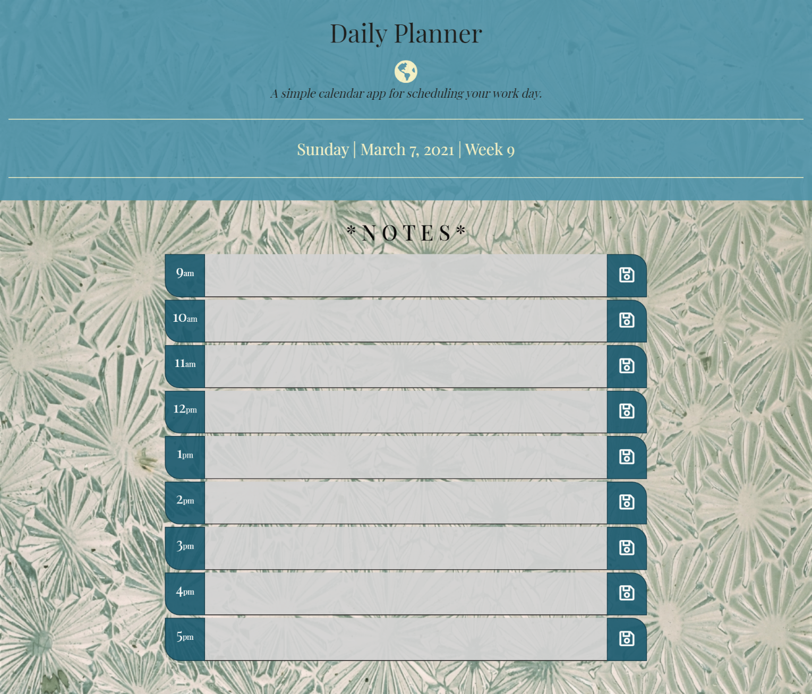

 

## **daily planner** 
 

[https://aranata.github.io/daily-planner/](https://aranata.github.io/daily-planner/) 
 
 

## description

***
 This is an application that allows a user to save events for each hour of the day and helps to manage time effectively. It is featuring a dynamically updated HTML and CSS powered by JavaScript code - and developed over a starter code. This work focuses on utilizing Moment.js to enable the application to utilize date and time. 
 
 

## acceptance criteria

***

The codebase achieves the following criteria: 

* GIVEN I am using a daily planner to create a schedule: 
* WHEN I open the planner; THEN the current day is displayed at the top of the calendar 
* WHEN I scroll down; THEN I am presented with timeblocks for standard business hours 
* WHEN I view the timeblocks for that day; THEN each timeblock is color coded to indicate whether it is in the past, present, or future 
* WHEN I click into a timeblock; THEN I can enter an event 
* WHEN I click the save button for that timeblock; THEN the text for that event is saved in local storage 
* WHEN I refresh the page; THEN the saved events persist 

 
 

## usage

***

A full view of the page  
 

 
 

A short video that shows how the UI works. 
 

 
 

## some valuable references

***

These notes and links are listing some valuable references among others that I used doing this project: 
 

[https://jquery.com/](https://jquery.com/)

[https://getbootstrap.com/](https://getbootstrap.com/)

[https://momentjs.com/docs/#/displaying/](https://momentjs.com/docs/#/displaying/)

[https://developer.mozilla.org/](https://developer.mozilla.org/)

[https://favicon.io/favicon-generator/](https://favicon.io/favicon-generator/)

[https://fonts.google.com/?preview.text_type=custom](https://fonts.google.com/?preview.text_type=custom)

[https://fontawesome.com/](https://fontawesome.com/)

[https://shields.io/category/dependencies/](https://shields.io/category/dependencies/)

[https://www.screencastify.com/](https://www.screencastify.com/)

 
 

## credits

***

Stephen Woosley - Bootcamp Instructor 
Patrick Haberern - Bootcamp TA 
Tim Nagorski - Bootcamp TA 
Sean Walmer - Bootcamp TA 
Alexis San Javier - Bootcamp Tutor 
 
 

## license

***

This is an assigment done under a bootcamp program, it is public but please contact the publisher before you use or 
change any content. 
ghibli.github@gmail.com
 
 

## badges

***

 
 

---
